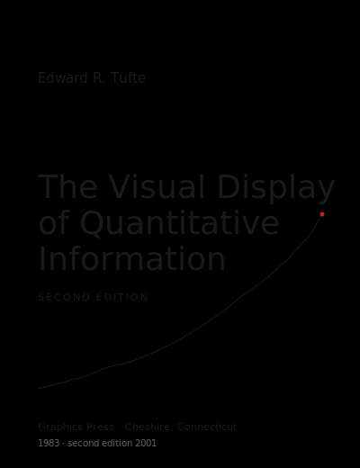
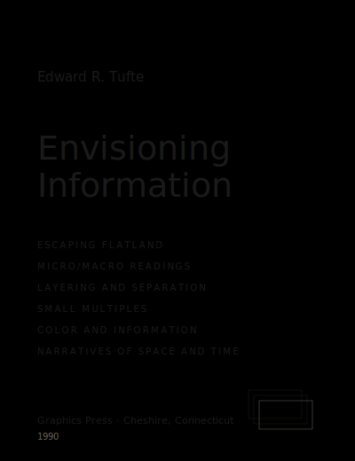
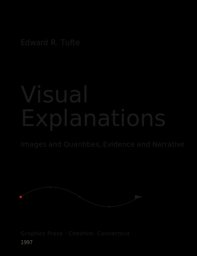
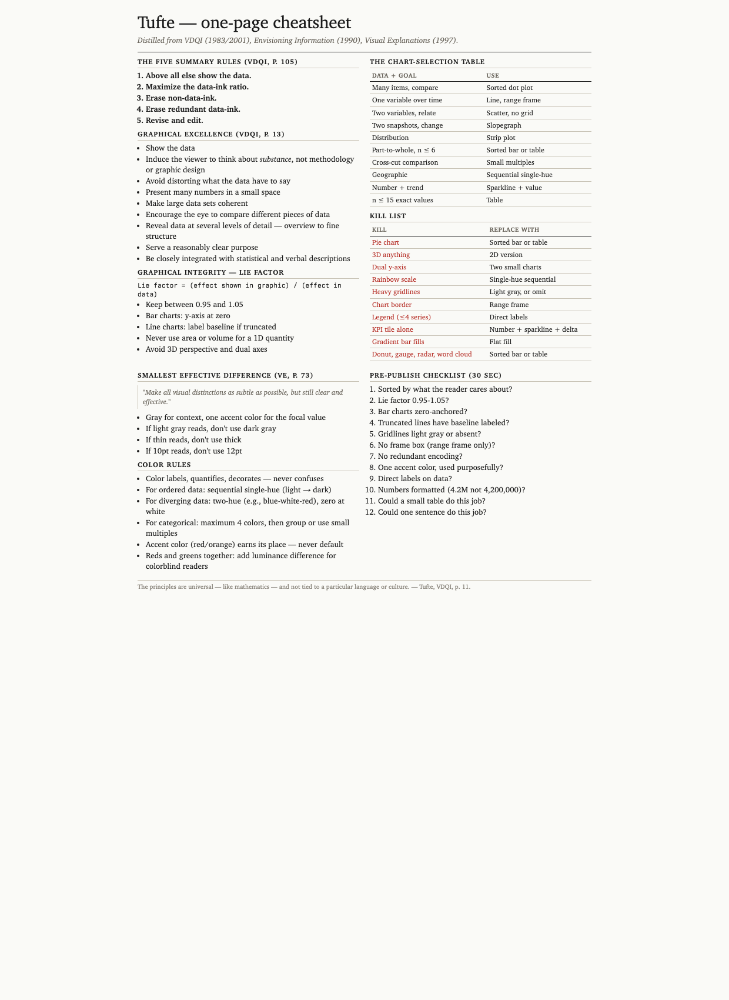
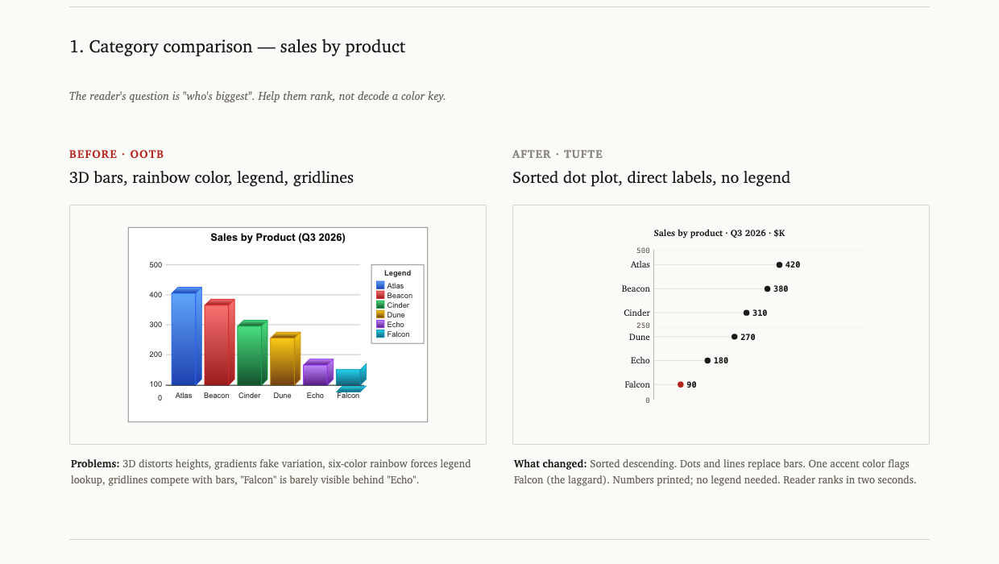
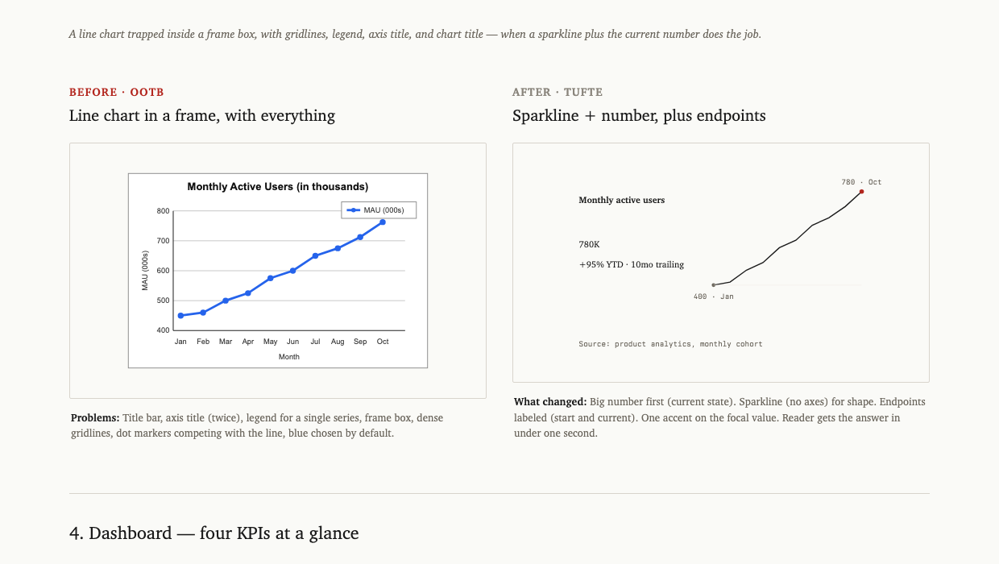
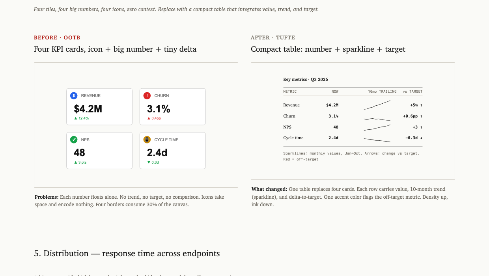
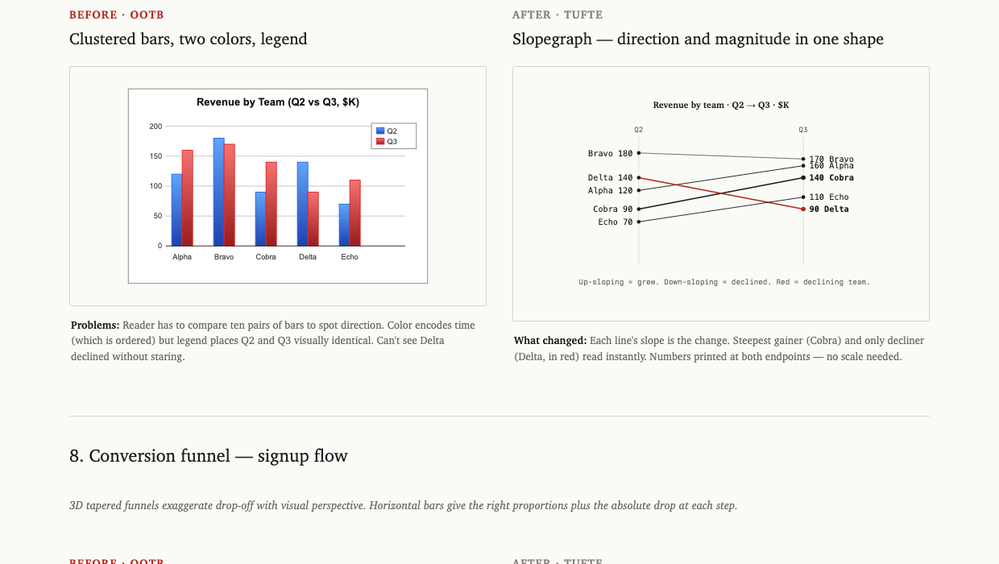
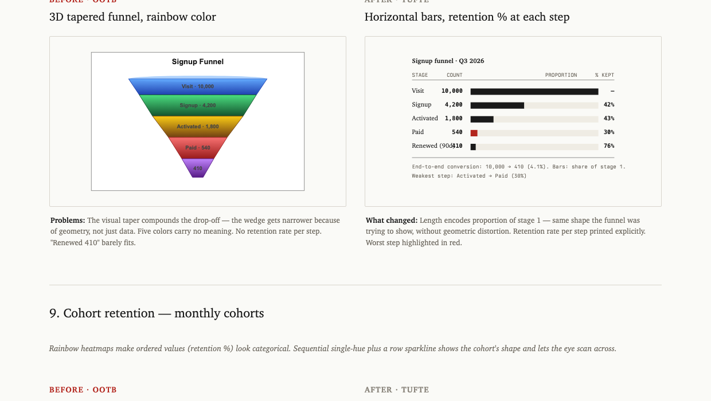
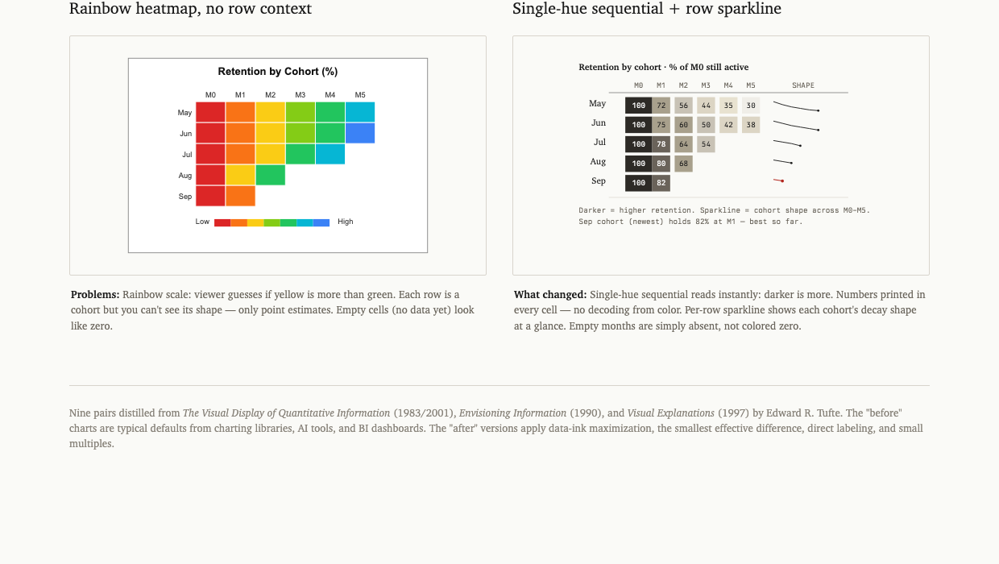

# tufte-claude-skill

A Claude Code skill that turns "make me a chart" into a Tufte-compliant chart. Distilled from the three foundational books by Edward R. Tufte.

<table>
  <tr>
    <td align="center" width="33%"></td>
    <td align="center" width="33%"></td>
    <td align="center" width="33%"></td>
  </tr>
  <tr>
    <td align="center"><b>The Visual Display of Quantitative Information</b><br/><i>1983 · 2nd ed. 2001</i><br/><sub>pictures of <b>numbers</b></sub></td>
    <td align="center"><b>Envisioning Information</b><br/><i>1990</i><br/><sub>pictures of <b>nouns</b></sub></td>
    <td align="center"><b>Visual Explanations</b><br/><i>1997</i><br/><sub>pictures of <b>verbs</b></sub></td>
  </tr>
</table>

---

## Install

Clone into your Claude Code skills directory:

```bash
git clone https://github.com/aref-vc/tufte-claude-skill.git ~/.claude/skills/tufte
```

That's it. Claude Code auto-loads the skill on next launch. To verify, run `/tufte` or ask Claude to "make a chart of anything."

To update later:

```bash
cd ~/.claude/skills/tufte && git pull
```

To uninstall:

```bash
rm -rf ~/.claude/skills/tufte
```

---

## The three books, distilled

Tufte gives the three-book taxonomy himself on page 9 of *Visual Explanations*:

- **VDQI** — how to depict data and enforce statistical honesty. The book that gave us *data-ink ratio*, *chartjunk*, *lie factor*, *small multiples*.
- **EI** — how to lay out information in space. Layering, micro/macro readings, color rules, escaping flatland.
- **VE** — how to show motion, causality, narrative. The smallest effective difference, parallelism, visual confections.

Together they yield the ten principles this skill applies.

### The ten principles

1. **Show the data.** Above all else. Every other decision asks "does this help the reader see the data?"
2. **Maximize the data-ink ratio.** Ink that would change if the data changed is data-ink. Everything else is overhead.
3. **Erase non-data-ink.** Drop the frame box, drop the gridlines, drop the ticks at minor units.
4. **Erase redundant data-ink.** Pick one encoding per quantity. A bar plus a number plus a gridline plus an axis tick all saying "37" is one thing said four times.
5. **Graphical integrity.** Lie factor between 0.95 and 1.05. Bar charts start at zero. Never use area for a 1D quantity.
6. **Small multiples.** When you have a cross-cut (region, segment, cohort), make N small charts on a shared scale instead of one chart with N lines.
7. **Layering and separation.** Data on top, labels next, scaffolding faintest. Watch for the *1+1=3 effect* — when two heavy elements interact to create unintended visual noise.
8. **Micro/macro readings.** Good charts work at two scales: one shape from across the room, every data point legible up close.
9. **The smallest effective difference.** "Make all visual distinctions as subtle as possible, but still clear and effective." Gray for context, one accent for focus.
10. **Word-data integration.** Sparklines belong in sentences. Numbers belong next to their visual. Tables are charts too.

Tufte's own five-line summary from VDQI p.105:

> Above all else show the data.
> Maximize the data-ink ratio.
> Erase non-data-ink.
> Erase redundant data-ink.
> Revise and edit.

---

## How the skill works

When you ask Claude to make, design, critique, or improve any chart, the skill activates automatically. It then:

1. **Reads `principles.md`** to recall the ten rules.
2. **Picks the chart type** from `chart-selection.md` based on your data shape and goal — not from what's familiar or what the library makes easy.
3. **Applies `kill-list.md`** — removes the things that don't belong (3D, pie, dual-axis, rainbow scales, frame boxes, redundant legends).
4. **Produces the chart** in your preferred stack: self-contained HTML/SVG, or React (Recharts + D3).
5. **Runs `checklist.md`** as a final pass before declaring it done.

Default strictness: Tufte by default, override per chart on request ("I need a pie because the CFO wants one" → comply, but note the alternative).

---

## The one-page cheatsheet

A printable reference covering principles, lie-factor formula, chart-selection table, kill list, color rules, and the 12-item checklist. Open [`cheatsheet.html`](./cheatsheet.html) in a browser or print [`cheatsheet.pdf`](./cheatsheet.pdf).



---

## Before and after

Nine pairs comparing typical AI/BI default output (left) to Tufte-applied output (right). The full interactive gallery is at [`before-after.html`](./before-after.html) — open in any browser. Six pairs inlined here:

### 1. Category comparison — sales by product



3D bars with a six-color rainbow legend become a sorted dot plot with direct labels. The reader ranks in two seconds instead of decoding a key.

### 2. Time series — monthly active users



A line chart trapped in a frame box (with gridlines, legend, axis title, chart title) becomes a sparkline plus the current value plus two endpoint labels. Same data, ~80% less ink.

### 3. Dashboard — four KPIs



Four KPI tiles with giant numbers and decorative icons become a compact table with value, sparkline (10-month trend), and delta-to-target. One accent color flags the metric that's off-target.

### 4. Period comparison — Q2 vs Q3 by team



Clustered bars (two colors, ten bars to mentally pair up) become a slopegraph. Each line's slope is the change. Steepest gainer and only decliner read instantly without decoding a legend.

### 5. Conversion funnel — signup flow



A 3D tapered funnel chart (where the visual taper exaggerates the drop-off) becomes horizontal bars sized by share of stage 1, with retention percentage printed per step. The worst step is annotated.

### 6. Cohort retention



A rainbow heatmap (where viewers guess if yellow is more than green) becomes a sequential single-hue table with numbers printed in every cell and a sparkline showing each cohort's decay shape.

The other three pairs in the gallery: part-to-whole (pie → sorted table), distribution (rainbow histogram → strip plot with quantile markers), geographic (rainbow choropleth → sequential single-hue with annotations).

---

## When to use the skill

The skill auto-activates on any of these:

- "Make a chart of...", "visualize...", "graph...", "plot..."
- "Build a dashboard for...", "design a KPI tile..."
- "Improve this chart", "critique this visual"
- "What chart should I use for...?"
- Direct invocation: `/tufte` or mentioning Tufte by name
- Any project where chart code is being added or edited

It does *not* activate for:

- Logo design, illustration, or decorative graphics
- Flowcharts, architecture diagrams, hand-drawn sketches
- Pure typography or layout that has no quantitative data

---

## How to use the skill

### Fast path

Just ask. The skill loads automatically and produces a Tufte-compliant chart:

> Make a chart of monthly revenue for the last 12 months

You'll get a sparkline with the current value, two endpoint labels, no frame box, no legend.

### Stack choice

Tell Claude which output you want:

| Say | You'll get |
|---|---|
| "as inline SVG" or no preference | Self-contained HTML/SVG, single file |
| "in React" or "with Recharts" | Recharts component with Tufte theme |
| "with D3" | D3-in-React (for dot plots, slopegraphs, custom small multiples) |

### Override the defaults

If you specifically need something on the kill list:

> Make a pie chart of revenue mix — the CFO wants a pie

Claude will produce the pie, but include a one-line comment noting the Tufte alternative (a sorted table). You stay in control.

### Iterate on an existing chart

Paste your chart code or screenshot and say:

> Apply Tufte to this

Claude will identify violations (frame box, gridlines, gradient fills, redundant legend, wrong sort), and produce a rewritten version.

---

## File index

| File | Purpose |
|---|---|
| [`SKILL.md`](./SKILL.md) | Trigger description + skill index (loaded by Claude) |
| [`principles.md`](./principles.md) | The ten rules, with Tufte's exact quotes |
| [`chart-selection.md`](./chart-selection.md) | Data + goal → chart type decision table |
| [`kill-list.md`](./kill-list.md) | What to remove from any chart |
| [`before-after.html`](./before-after.html) | Nine side-by-side comparisons (open in browser) |
| [`checklist.md`](./checklist.md) | 12-item pre-publish check |
| [`cheatsheet.html`](./cheatsheet.html) / [`cheatsheet.pdf`](./cheatsheet.pdf) | One-page printable reference |
| [`presets/html-svg.md`](./presets/html-svg.md) | Style tokens + working SVG templates (sparkline, dot plot, line, small multiples, sparkline-in-table) |
| [`presets/react.md`](./presets/react.md) | Recharts theme + D3-in-React patterns (slopegraph, dot plot, what-to-never-import list) |

---

## Requirements

- [Claude Code](https://docs.claude.com/en/docs/claude-code) installed
- Skill auto-loads from `~/.claude/skills/`
- No other dependencies for the skill itself
- The cheatsheet PDF is included, but to regenerate it from the HTML you'll need [`weasyprint`](https://weasyprint.org/) (`pip install weasyprint`)

---

## Contributing

Pull requests welcome. Useful additions:

- More before/after pairs (sankey, network, gantt, calendar heatmap, control chart)
- Output presets for other stacks: Python (matplotlib, plotly), Observable Plot, Vega-Lite, ggplot2
- Examples that show Tufte applied to real-world charts you've improved

Open an issue first for anything that adds a new chart type to the decision table — let's discuss the rule before adding it.

---

## License

[MIT](./LICENSE). Use it, modify it, ship it.

The skill content is original; quotations from Tufte's books are used under fair-use for educational reference and are attributed inline.

---

> The principles of information design are universal — like mathematics — and are not tied to unique features of a particular language or culture.
>
> — Edward R. Tufte, *Envisioning Information*, p. 10
